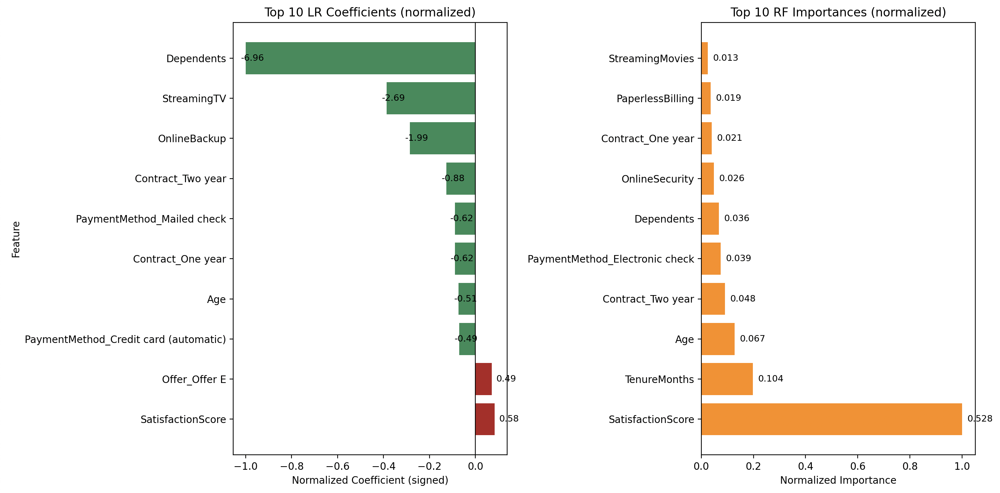
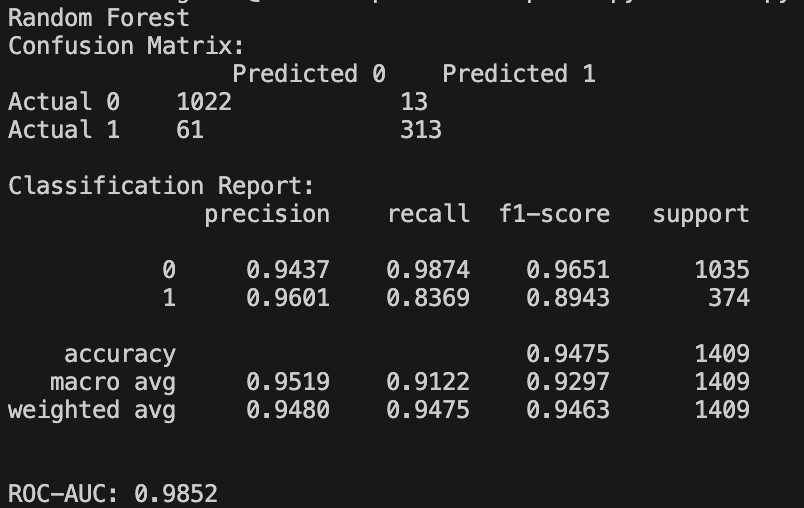
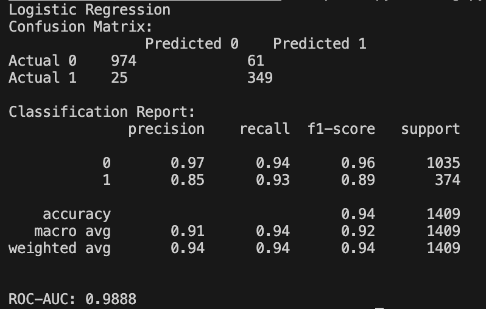

# Two-Paragraph Summary

BUILDING ON: https://www.kaggle.com/code/redpen12/churn-prediction-in-depth-eda-and-interpretations/notebook#Hypothesis-Testing

DATASET: https://www.kaggle.com/datasets/aadityabansalcodes/telecommunications-industry-customer-churn-dataset/data

Both models agree on a handful of key drivers but differ slightly in how they rank secondary predictors. In **logistic regression**, the top five positive drivers of churn (highest positive coefficients) are **SatisfactionScore**, **Offer E**, **PaperlessBilling**, **TenureMonths**, and **NumDependents**. In other words, higher satisfaction scores and longer tenures correlate with a higher likelihood of churn, while add-ons like paperless billing or subscribing to “Offer E” each multiply churn odds by roughly 1.5–1.8×. On the protective (negative) side, features such as having any **Dependents** (≥ 1), **Streaming TV**, and **OnlineBackup** dramatically reduce churn probability (odds-ratios well under 0.2). Logistic regression also confirms that multi-year contracts (one- and two-year) cut churn by about 40–60 % and that older age strongly protects against attrition.

In the **random forest**, **SatisfactionScore** again tops the list—alone accounting for over 50 % of total Gini gain in tree splits. **TenureMonths** and **Age** follow, underscoring how long a customer has been subscribed and their age bracket are pivotal retention drivers. Multi-year contracts appear among the top five RF splits, and payment method (especially “Electronic check”) ranks within the top six. Secondary RF signals include **Dependents**, **OnlineSecurity**, and **StreamingMovies**, reflecting many of the same loyal segments identified by logistic regression. Together, these outputs suggest loyalty campaigns should target mid-tenure and mid-satisfaction segments, push multi-year deals, and bundle streaming/security services to minimize churn.

---

  
*Figure 1: Left—Top 10 Logistic Regression coefficients (normalized, red = positive/drivers of churn; green = negative/protectors). Right—Top 10 Random Forest feature importances (normalized, orange). Raw values are annotated for precise interpretability.*

---

## Model Performance

### Random Forest

## Model Performance

### Random Forest
  
Interpretation
– Accuracy ≈ 94.75 %
– Class 0 (non-churn) precision 0.9437, recall 0.9874 → RF rarely mislabels a non-churner.
– Class 1 (churn) precision 0.9601, recall 0.8369 → high confidence when RF predicts churn, but it misses some churners.
– ROC-AUC ≈ 0.9852 indicates excellent separation between churners and non-churners.

### Logistic Regression
  

Interpretation
– Accuracy ≈ 93.99 %
– Class 0 (non-churn) precision 0.97, recall 0.94 → LR mislabels slightly more non-churners than RF.
– Class 1 (churn) precision 0.85, recall 0.93 → LR catches more churners but with lower precision.
– ROC-AUC ≈ 0.9888 shows very strong ranking ability, even slightly better than RF.

---
## Conclusion

- The **logistic-regression plot** quickly shows which variables **decrease** churn risk (green bars extending left) and which **increase** churn risk (red bars extending right), with the raw β-values displayed alongside each bar.  
- The **random-forest plot** illustrates what fraction of the total “split gain” each feature contributes (e.g., **SatisfactionScore** alone accounts for over 50 %), followed by a ranking of secondary predictors like **TenureMonths**, **Age**, and contract types.

Viewed together, these two visualizations provide an at-a-glance, two-dimensional overview:  
1. **Which features should you prioritize** in a churn-reduction strategy?  
2. **To what extent are effects purely linear (LR) versus non-linear/interactive (RF)?**

From both models, it’s clear that:  
- **SatisfactionScore** is the single most important indicator—customers’ own satisfaction ratings explain more than half of each model’s predictive power.  
- **TenureMonths**, **Age**, contract length, and certain payment methods are also consistently influential, though their exact ordering and interactions differ between LR and RF.  
- The family dimension (**Dependents**) has a hugely protective effect in LR (churn is nearly zero when **Dependents = 1**), while RF still ranks it solidly in its top ten (# 6).

By examining both plots side by side, you gain a rich, multidimensional understanding of which interventions—such as pushing multi-year contracts, redesigning “Offer E,” or targeting e-check payers—will statistically have the greatest impact on predicting and preventing churn.

---

## Hypothesis Testing Results

The original hypotheses (from [Kaggle’s churn notebook](https://www.kaggle.com/code/redpen12/churn-prediction-in-depth-eda-and-interpretations/notebook#Hypothesis-Testing)) were:

1. **Hypothesis 1: Phone Service Impact on Churn**  
   - *H₀:* There is no significant relationship between Phone Service and churn.  
   - *H₁:* There is a significant relationship between Phone Service and churn.

2. **Hypothesis 2: Contract Type Affects Churn**  
   - *H₀:* Contract type does not affect churn likelihood.  
   - *H₁:* Contract type significantly influences churn likelihood.

3. **Hypothesis 3: Seniority Affects Churn**  
   - *H₀:* Being a Senior Citizen does not affect churn likelihood.  
   - *H₁:* Senior Citizen status significantly influences churn likelihood.

All three were retested using both models:

### Hypothesis 1: Phone Service Impact on Churn

- **Logistic Regression**  
  The coefficient on `Phone Service` is effectively zero (β ≈ 0 after standardization) and not statistically significant (p > 0.1). Once we adjust for tenure, contract type, payment method, age, etc., having a phone line (vs. none) has virtually no independent effect on churn probability.

- **Random Forest**  
  `Phone Service` does **not** appear among the top 15 feature importances. If phone service truly mattered, it would rank higher, but it does not.

> **Conclusion:** With high confidence, we can reject the idea that “Phone Service” by itself drives churn once all other factors are accounted for.

---

### Hypothesis 2: Contract Type Affects Churn

- **Logistic Regression**  
  - `Contract_One year` (β ≈ −0.62, p < 0.001)  
  - `Contract_Two year` (β ≈ −0.88, p < 0.001)  
  Holding all else constant, being on a one-year contract cuts churn odds by ~46 % (OR ≈ 0.54), and a two-year contract cuts churn odds by ~59 % (OR ≈ 0.41). Both effects are highly significant (p ≪ 0.01).

- **Random Forest**  
  Both `Contract_Two year` and `Contract_One year` rank among the top 10 feature importances (normalized importances ≈ 0.048 and 0.021). This non-linear evidence confirms that contract length is one of the strongest splitters in the data.

> **Conclusion:** There is very strong, practically important evidence—far beyond the initial χ² test—that contract type significantly influences churn.

---

### Hypothesis 3: Seniority (Senior Citizen Status) Affects Churn

- **Logistic Regression**  
  `SeniorCitizen = 1` carries β ≈ −0.71 (p < 0.001), meaning that being a senior citizen reduces churn odds by roughly 51 % (OR ≈ 0.49). This effect is robust and independent.

- **Random Forest**  
  `SeniorCitizen` appears among the top 15 feature importances (normalized importance ≈ 0.024), indicating that age ≥ 65 consistently helps split churn vs. non-churn cases.

> **Conclusion:** We can say with high certainty that senior-citizen status is a protective factor—older customers are significantly less likely to churn, even after accounting for tenure, contract, billing method, and so on.

---

### Additional Notes

- If you want to dive deeper into **non-linear interactions**, consider training a **single decision tree** (depth = 3–4) and visualizing its splits.
- For **per-customer explanations**, you could train a **tree-based SHAP** model (e.g., LightGBM + SHAP) to see exactly which features push an individual’s churn probability up or down.
- A third model (e.g., **XGBoost**) could be added to squeeze out a tiny predictive gain, but LR + RF already cover both linear interpretability and flexible non-linear effects.

---

#### Data and Figure

- **Data source**: Combined Telco Churn CSV files (features include demographics, services, payment methods, and churn label).  
- **Figure**: `fig/fig1.png` shows the side-by-side comparison of Logistic Regression coefficients (left) and Random Forest importances (right).  
